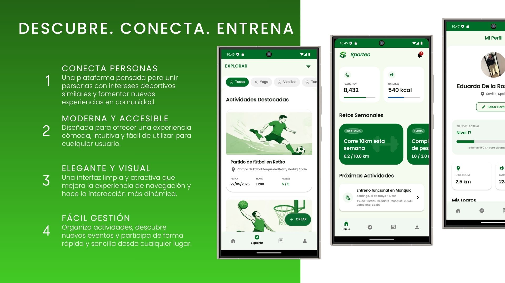
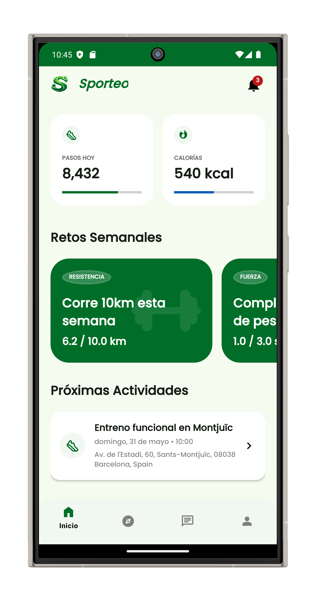
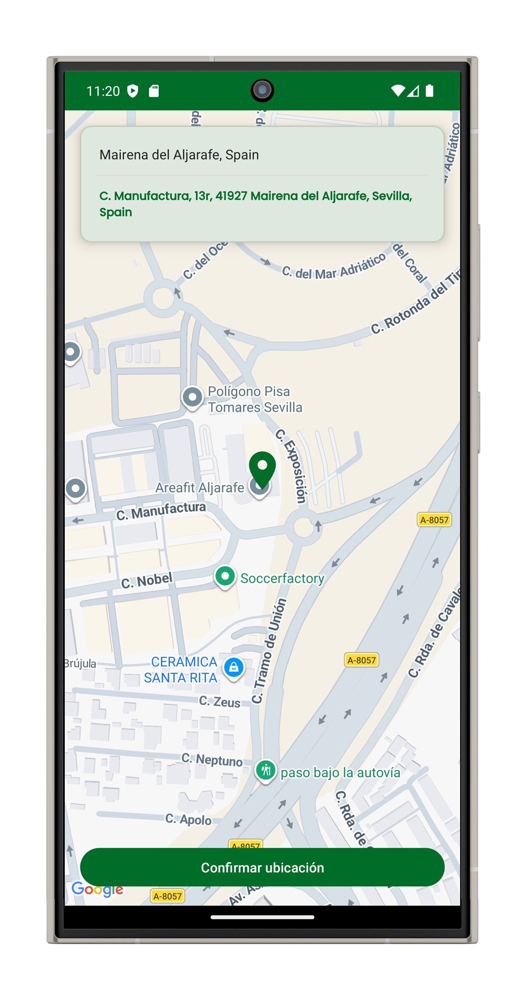
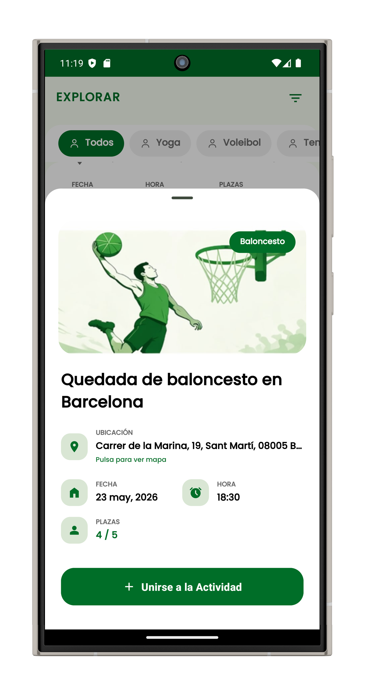

🚀 Aplicación móvil para conectar personas a través del deporte.
# 🏃 Sporteo

> Conectando personas a través del deporte.

Sporteo es una aplicación móvil desarrollada para facilitar la creación y participación en actividades deportivas entre usuarios. La plataforma permite organizar eventos deportivos, descubrir nuevas actividades y conectar con personas que comparten los mismos intereses deportivos.

---

## 📱 Características principales

- Registro e inicio de sesión de usuarios.
- Gestión de perfil personal.
- Creación de actividades deportivas.
- Inscripción a actividades de otros usuarios.
- Integración con Google Maps y Google Places.
- Gestión de imágenes mediante Cloudinary.
- Arquitectura cliente-servidor.
- API REST desarrollada con Spring Boot.

---

## 📸 Capturas de pantalla

| Pantalla                  | Captura                                        | Descripción                                                                                                                                                  |
| ------------------------- | ---------------------------------------------- | ------------------------------------------------------------------------------------------------------------------------------------------------------------ |
| **Login**                 |          | Permite a los usuarios autenticarse mediante correo electrónico y contraseña, así como acceder a la recuperación de cuenta o al registro de nuevos usuarios. |
| **Registro**              |       | Formulario de creación de cuenta con validación de datos y selección de localidad mediante autocompletado.                                                   |
| **Home**                  |           | Pantalla principal de navegación desde la que el usuario accede a las funcionalidades más importantes de la aplicación.                                      |
| **Explorar actividades**  |        | Muestra las actividades deportivas disponibles, permitiendo descubrir nuevos eventos organizados por otros usuarios.                                         |
| **Selector de ubicación** |  | Permite seleccionar de forma visual la ubicación exacta donde se desarrollará una actividad deportiva.                                                       |
| **Detalle de actividad**  |  | Muestra toda la información relacionada con una actividad, incluyendo descripción, ubicación y participantes.                                                |
| **Perfil**                |        | Permite consultar y editar la información personal del usuario, así como gestionar su imagen de perfil.                                                      |


---

## 🏗️ Arquitectura

El proyecto sigue una arquitectura cliente-servidor compuesta por:

### Frontend
- Android Studio
- Java
- Material Design
- RecyclerView
- Fragments
- Glide

### Backend
- Spring Boot
- Spring Data JPA
- Spring Web MVC
- Lombok

### Base de datos
- PostgreSQL

### Servicios externos
- Google Maps API
- Google Places API
- Cloudinary

---

## ⚙️ Arquitectura del Backend

El backend está organizado siguiendo una arquitectura en capas:

```text
Controller
    ↓
Service
    ↓
Repository
    ↓
Database
```

### Controller
Gestiona las peticiones HTTP y expone los endpoints de la API.

### Service
Contiene la lógica de negocio de la aplicación.

### Repository
Gestiona el acceso a datos mediante Spring Data JPA.

### Entity
Representa las tablas y relaciones de la base de datos.

### DTO
Permite transferir información entre capas y hacia el frontend.

---

## 🗄️ Base de datos

Las principales entidades del sistema son:

- Usuario
- Actividad
- Inscripción
- Deporte

Relación principal:

```text
Usuario ←→ Inscripción ←→ Actividad
```

---

## 🚀 Tecnologías utilizadas

| Categoría | Tecnología |
|------------|------------|
| Frontend | Java |
| Mobile | Android Studio |
| Backend | Spring Boot |
| ORM | Spring Data JPA |
| Base de datos | PostgreSQL |
| Imágenes | Cloudinary |
| Mapas | Google Maps |
| Ubicaciones | Google Places |
| Control de versiones | GitHub |
| Testing | Postman |
| Gestión | Trello |

---

## 🎯 Objetivos del proyecto

- Facilitar la organización de actividades deportivas.
- Fomentar la práctica deportiva en comunidad.
- Aplicar una arquitectura profesional cliente-servidor.
- Integrar servicios externos reales.
- Desarrollar una aplicación escalable y mantenible.

---

## 🔮 Futuras mejoras

- Autenticación mediante Google, Facebook e Instagram.
- Autenticación biométrica.
- Sistema de notificaciones push.
- Chat entre participantes.
- Actividades por proximidad.
- Filtros avanzados.
- Sistema de gamificación.
- Salas privadas mediante códigos de invitación.

---

## 📚 Aprendizajes obtenidos

Este proyecto me ha permitido trabajar con tecnologías utilizadas en entornos profesionales:

- Desarrollo Android nativo.
- Diseño de APIs REST.
- Arquitectura en capas.
- Bases de datos relacionales.
- Integración de servicios externos.
- Gestión de proyectos mediante Git y Trello.

---

## 👨‍💻 Autor

**Eduardo De la Rosa**

📧 eduardoodelarosaa@gmail.com

🔗 LinkedIn: *((https://www.linkedin.com/in/eduardo-de-la-rosa-puerto-4a22b6200/))*

---

⭐ Si te ha parecido interesante el proyecto, no dudes en darle una estrella al repositorio.
